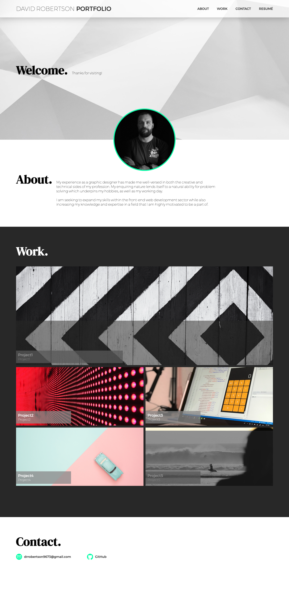
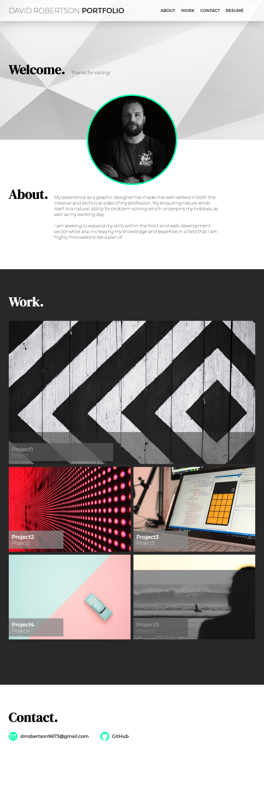
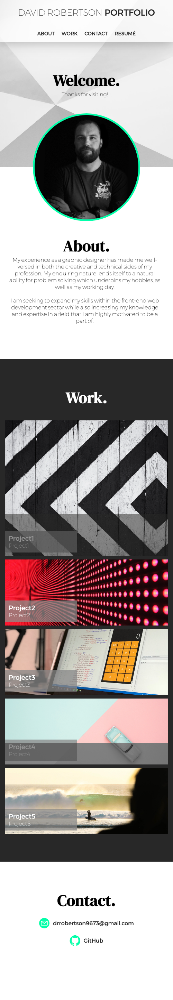

# DavidRobertson_Portfolio

## Description
The aim of this project was to build a portfolio page which I can add to as the course progresses.

The webpage needed to show my name, a recent photo or avatar and link sections about me, my work and how to contact me.

The webpage needed to responsive when changing various screen sizes.

## Installation

N/A

## Usage

The website can be accessed via an internet browser and you can navigate to different sections by clicking the links on the right of the navigation bar at the top of the page.

Link: https://drrobertson9673.github.io/W2_Portfolio_Challenge/

## Credits

N/A

## License

MIT licence